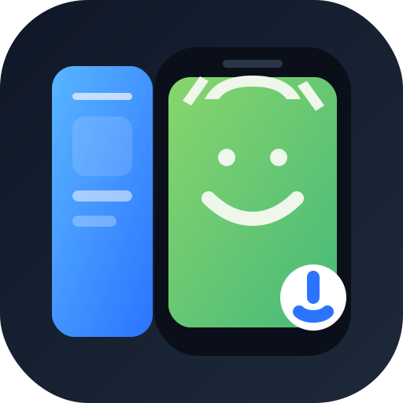

# Scrcpy Sidebar

<p align="center">
  
</p>

一个面向 `code-server` / `VS Code Web` 的 Android 投屏侧边栏扩展。  
它把 `scrcpy` 的视频与控制能力收进侧边栏里，适合在浏览器版 VS Code 中直接查看和操作远程设备。

## 特性

- 侧边栏内实时显示 Android 设备画面
- 打开设备选择器时自动读取 `adb devices`
- 支持多设备筛选，也支持直接输入 `IP` / `IP:PORT` 进行 `adb connect`
- 支持点击、拖拽、长按、滑动等基础触控
- 顶栏一键连接 / 断开
- 自动重连
- 支持 `su` / root 控制模式
- 支持连接期间保持常亮，并在断开后恢复锁屏超时
- 支持右键映射为返回键
- 可配置 FPS、分辨率上限、码率、编码格式、熄屏启动等参数

## 适用场景

- 在 `code-server` 中远程调试 Android App
- 云服务器 / NAS / 远端开发机上的 Android 设备联调
- 需要在一个浏览器标签页里同时写代码和看设备画面

## 技术方案

项目当前采用：

- `@yume-chan/adb-server-node-tcp`
- `@yume-chan/adb-scrcpy`
- `@yume-chan/scrcpy-decoder-webcodecs`
- 官方 `scrcpy-server 3.3.4`

说明：

- 设备端实际运行的是官方 `Genymobile/scrcpy` server
- 扩展端负责 ADB 连接、scrcpy 会话管理、视频转发和 webview 交互
- 浏览器端依赖 `WebCodecs` 解码视频

## 环境要求

- 已安装并启动 `adb server`
- `code-server` 运行在支持普通 Node Extension Host 的环境
- 浏览器支持 `WebCodecs`
- 若设备厂商限制输入注入，可选开启 root / `su`

## 快速开始

```bash
npm install
npm run build
```

开发模式：

```bash
npm run watch
```

然后在 `code-server` 中执行：

```text
Developer: Reload Window
```

## 打包

```bash
npm run build
npx @vscode/vsce package
```

生成产物：

- `scrcpy-sidebar-<version>.vsix`

扩展包仅包含运行所需文件：

- `dist/**`
- `media/**`
- `package.json`
- `README.md`
- `LICENSE`

## 设置项

主要设置项包括：

- `scrcpySidebar.maxFps`
- `scrcpySidebar.maxSize`
- `scrcpySidebar.videoBitRate`
- `scrcpySidebar.videoCodec`
- `scrcpySidebar.rootMode`
- `scrcpySidebar.screenOffOnStart`
- `scrcpySidebar.keepScreenAwake`
- `scrcpySidebar.audioEnabled`
- `scrcpySidebar.audioCodec`

当前默认策略：

- 默认使用 `H.264`
- 默认使用 `su`
- 默认开启“连接期间保持常亮”
- 默认不在连接后立即熄屏

## GitHub Actions

仓库内置 `build-extension` 工作流，用于：

- 安装依赖
- 执行 `typecheck`
- 执行构建
- 打包 `.vsix`
- 上传构建产物

你可以在 GitHub Actions 页面直接下载生成的 `.vsix`。

## 已知说明

- `H.265` / `AV1` 在部分浏览器 webview 中可能无法稳定解码，因此默认仍为 `H.264`
- 音频能力目前仍属于实验性功能
- 多个 `code-server` 标签页可能各自启动独立 extension host，因此仍可能出现多会话并行

## License

MIT
